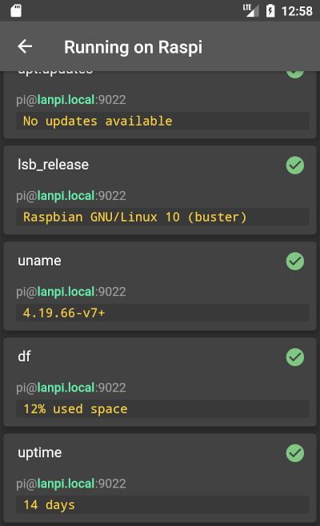

# Cluster Up

A simple server management app to learn flutter.
Based on the [first app tutorial](https://flutter.dev/docs/get-started/codelab) from [flutter.dev](https://flutter.dev).

# Try
You can try out Cluster Up here:  
https://play.google.com/store/apps/details?id=com.devsamuko.clusterup

# Screenshots

# Architecture

Overview over cluster up's architecture: https://elsamuko.github.io/clusterup/architecture.html
